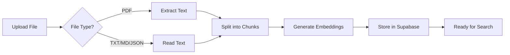
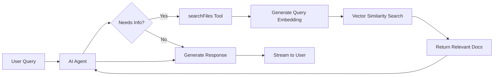

# 🌐 Agentic RAG Cyberpunk

A cutting-edge **Retrieval-Augmented Generation (RAG)** application with an AI agent powered by Google Gemini, featuring a stunning cyberpunk-themed UI. Upload documents, ask questions, and watch the AI agent intelligently search and retrieve information from your knowledge base.


## ✨ Features

- 🤖 **AI Agent with Tool Calling** - Powered by Google Gemini with autonomous tool execution
- 📚 **Document Ingestion** - Upload `.txt`, `.md`, `.json`, or `.pdf` files to build your knowledge base
- 🔍 **Semantic Search** - Vector-based similarity search using embeddings
- 💬 **Real-time Streaming** - Live AI responses with streaming support
- 🎨 **Cyberpunk UI** - Beautiful, futuristic interface with neon aesthetics
- 📊 **Execution Stream** - Real-time visualization of agent operations
- 🔒 **Type-Safe** - Full TypeScript support with proper type definitions
- 📄 **PDF Parsing** - Automatic text extraction from PDF documents

## 🏗️ Architecture

```
agentic-rag-cyberpunk/
├── src/
│   ├── app/
│   │   ├── api/
│   │   │   ├── chat/
│   │   │   │   └── route.ts          # AI Agent chat endpoint
│   │   │   └── ingest/
│   │   │       └── route.ts          # Document ingestion endpoint
│   │   ├── layout.tsx                # Root layout with metadata
│   │   └── page.tsx                  # Main application page
│   ├── components/
│   │   ├── chat-interface.tsx        # Main chat UI component
│   │   ├── execution-stream.tsx      # Real-time execution log
│   │   └── sidebar-nav.tsx           # Navigation sidebar
│   └── lib/
│       ├── ai-logic.ts               # AI SDK & Supabase configuration
│       ├── types.ts                  # TypeScript type definitions
│       └── utils.ts                  # Utility functions
├── .env                              # Environment variables
├── package.json                      # Dependencies and scripts
├── tsconfig.json                     # TypeScript configuration
├── tailwind.config.ts                # Tailwind CSS configuration
└── next.config.ts                    # Next.js configuration
```

## 🛠️ Tech Stack

### Core Framework
- **Next.js 15.1.0** - React framework with App Router
- **React 19.2.3** - UI library
- **TypeScript 5.9.3** - Type safety

### AI & ML
- **Vercel AI SDK 6.0.3** - AI agent framework
- **@ai-sdk/google 3.0.1** - Google Gemini integration
- **@ai-sdk/react 3.0.3** - React hooks for AI SDK
- **Google Generative AI 0.24.1** - Embeddings generation

### Database & Storage
- **Supabase 2.89.0** - PostgreSQL with pgvector extension
- Vector embeddings stored using `text-embedding-004`

### Document Processing
- **pdf2json** - PDF text extraction (Node.js-native)

### UI & Styling
- **Tailwind CSS 3.4.19** - Utility-first CSS
- **Lucide React 0.562.0** - Icon library
- **clsx & tailwind-merge** - Conditional styling

### Validation & Utilities
- **Zod 4.2.1** - Schema validation

## 🚀 Getting Started

### Prerequisites

- Node.js 18+ and npm
- Supabase account with a project
- Google AI API key

### 1. Clone the Repository

```bash
git clone https://github.com/yourusername/agentic-rag-cyberpunk.git
cd agentic-rag-cyberpunk
```

### 2. Install Dependencies

```bash
npm install
```

### 3. Set Up Supabase Database

Run this SQL in your Supabase SQL Editor:

```sql
-- Enable pgvector extension
create extension if not exists vector;

-- Create documents table
create table documents (
  id bigserial primary key,
  content text not null,
  embedding vector(768),
  metadata jsonb,
  created_at timestamp with time zone default now()
);

-- Create vector similarity search function
create or replace function match_documents(
  query_embedding vector(768),
  match_threshold float,
  match_count int
)
returns table (
  id bigint,
  content text,
  metadata jsonb,
  similarity float
)
language sql stable
as $$
  select
    documents.id,
    documents.content,
    documents.metadata,
    1 - (documents.embedding <=> query_embedding) as similarity
  from documents
  where 1 - (documents.embedding <=> query_embedding) > match_threshold
  order by similarity desc
  limit match_count;
$$;

-- Create index for faster similarity search
create index on documents using ivfflat (embedding vector_cosine_ops)
with (lists = 100);
```

### 4. Configure Environment Variables

Create a `.env` file in the root directory:

```env
# Supabase Configuration
SUPABASE_URL=your_supabase_project_url
SUPABASE_SERVICE_ROLE_KEY=your_service_role_key

# Google AI Configuration
GOOGLE_GENERATIVE_AI_API_KEY=your_google_ai_api_key
```

### 5. Run the Development Server

```bash
npm run dev
```

Open [http://localhost:3000](http://localhost:3000) in your browser.

## 📖 How It Works

### 1. Document Ingestion Flow



1. User uploads a document (`.txt`, `.md`, `.json`, or `.pdf`)
2. For PDFs, text is extracted using pdf2json (Node.js-native library)
3. Document is split into chunks (paragraphs)
4. Each chunk is converted to a 768-dimensional vector using `text-embedding-004`
5. Vectors are stored in Supabase with pgvector

### 2. Chat & Retrieval Flow



1. User sends a message
2. AI Agent (Google Gemini) analyzes the query
3. If information is needed, agent calls `searchFiles` tool
4. Query is converted to embedding and searched in vector database
5. Relevant documents are retrieved and provided to the agent
6. Agent generates a response citing sources
7. Response is streamed to the user in real-time

## 🔧 Key Components

### AI Agent (`src/app/api/chat/route.ts`)

Uses the **ToolLoopAgent** class from AI SDK v6:

```typescript
const ragAgent = new ToolLoopAgent({
  model: google('gemini-3-flash-preview'),
  instructions: `You are the "RAG Control Engine"...`,
  tools: {
    searchFiles: tool({
      description: 'Search internal documents...',
      inputSchema: z.object({
        query: z.string()
      }),
      execute: async ({ query }) => {
        // Vector search implementation
      }
    })
  }
});
```

### Message Format Conversion

Handles conversion between UI Message format (from `@ai-sdk/react`) and Core Message format (expected by Agent):

```typescript
interface UIMessage {
  role: string;
  parts?: UIMessagePart[];
  content?: string;
}

interface CoreMessage {
  role: 'user' | 'assistant' | 'system' | 'tool';
  content: string;
}
```

## 🐛 Common Issues & Solutions

### Issue 1: "Invalid prompt: messages do not match ModelMessage[] schema"

**Cause:** Frontend sends messages in UIMessage format (with `parts` array), but Agent expects CoreMessage format (with `content` string).

**Solution:** ✅ Already implemented - `convertUIMessagesToCoreMessages()` function handles the conversion.

### Issue 2: "Property 'toUIMessageStreamResponse' does not exist"

**Cause:** Using AI SDK v6 methods incorrectly or missing await.

**Solution:** 
```typescript
const result = await ragAgent.stream({ messages });
return result.toUIMessageStreamResponse();
```

### Issue 3: TypeScript error with tool definition

**Cause:** Using old `parameters` instead of `inputSchema` in tool definition.

**Solution:** Use AI SDK v6 syntax:
```typescript
tool({
  inputSchema: z.object({ query: z.string() }), // ✅ Correct
  // parameters: z.object({ query: z.string() }), // ❌ Old v2 syntax
})
```

### Issue 4: Embedding dimension mismatch

**Cause:** Supabase vector column dimension doesn't match embedding model output.

**Solution:** Ensure vector dimension in SQL matches model:
- `text-embedding-004` → `vector(768)`

### Issue 5: PDF parsing errors

**Cause:** Various PDF libraries have compatibility issues with Next.js server-side environment.

**Libraries tested:**
- `pdf-parse` - Requires browser APIs (DOMMatrix, Canvas) ❌
- `pdfjs-dist` - Webpack/ESM compatibility issues ❌
- `pdf2json` - Works with proper error handling ✅

**Solution:** Use `pdf2json` with proper error handling for malformed URI-encoded text:
```typescript
try {
  text += decodeURIComponent(run.T) + ' ';
} catch {
  text += run.T + ' '; // Fallback for malformed encoding
}
```

### Issue 6: CORS or API key errors

**Cause:** Missing or incorrect environment variables.

**Solution:** 
1. Check `.env` file exists and has correct values
2. Restart dev server after changing `.env`
3. Verify API keys are valid

## 🎨 UI Customization

The cyberpunk theme uses Tailwind CSS with custom colors:

```javascript
// tailwind.config.ts
colors: {
  cyan: { 400: '#22d3ee', 500: '#06b6d4', ... },
  indigo: { 400: '#818cf8', 500: '#6366f1', ... },
  slate: { 900: '#0f172a', 950: '#020617', ... }
}
```

Modify these values to change the color scheme.

## 📊 Performance Optimization

- **Streaming responses** - Reduces perceived latency
- **Vector indexing** - IVFFlat index for fast similarity search
- **Chunk size optimization** - Paragraphs split at 50+ characters
- **Parallel embedding** - Multiple chunks processed concurrently

## 🔐 Security Best Practices

- ✅ Service role key stored in environment variables
- ✅ API routes protected by Next.js server-side execution
- ✅ Input validation using Zod schemas
- ✅ Error handling prevents information leakage

## 🚢 Deployment

### Deploy to Vercel

1. Push code to GitHub
2. Import project in Vercel
3. Add environment variables in Vercel dashboard
4. Deploy!

### Environment Variables for Production

Ensure these are set in your deployment platform:
- `SUPABASE_URL`
- `SUPABASE_SERVICE_ROLE_KEY`
- `GOOGLE_GENERATIVE_AI_API_KEY`

## 🤝 Contributing

Contributions are welcome! Please follow these steps:

1. Fork the repository
2. Create a feature branch (`git checkout -b feature/amazing-feature`)
3. Commit your changes (`git commit -m 'Add amazing feature'`)
4. Push to the branch (`git push origin feature/amazing-feature`)
5. Open a Pull Request

## 📝 License

This project is licensed under the MIT License.

## 🙏 Acknowledgments

- [Vercel AI SDK](https://sdk.vercel.ai) - Excellent AI agent framework
- [Supabase](https://supabase.com) - Amazing PostgreSQL platform with pgvector
- [Google Gemini](https://ai.google.dev) - Powerful LLM and embeddings
- [Lucide Icons](https://lucide.dev) - Beautiful icon library

## 📧 Contact

For questions or support, please open an issue on GitHub.

---

**Built with 💙 using AI SDK v6, Next.js 15, and Supabase**
